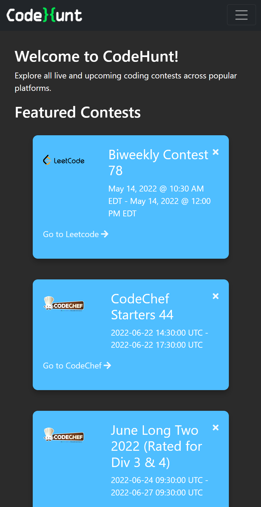
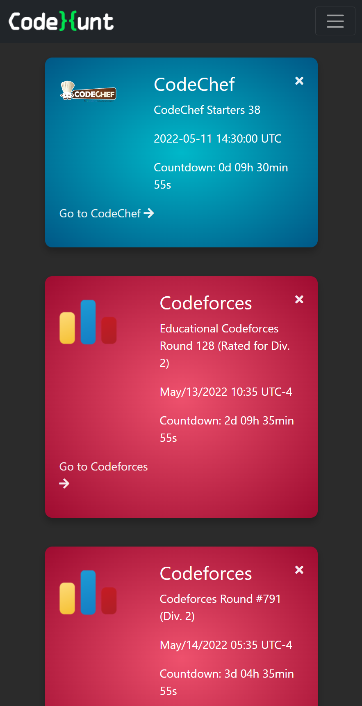
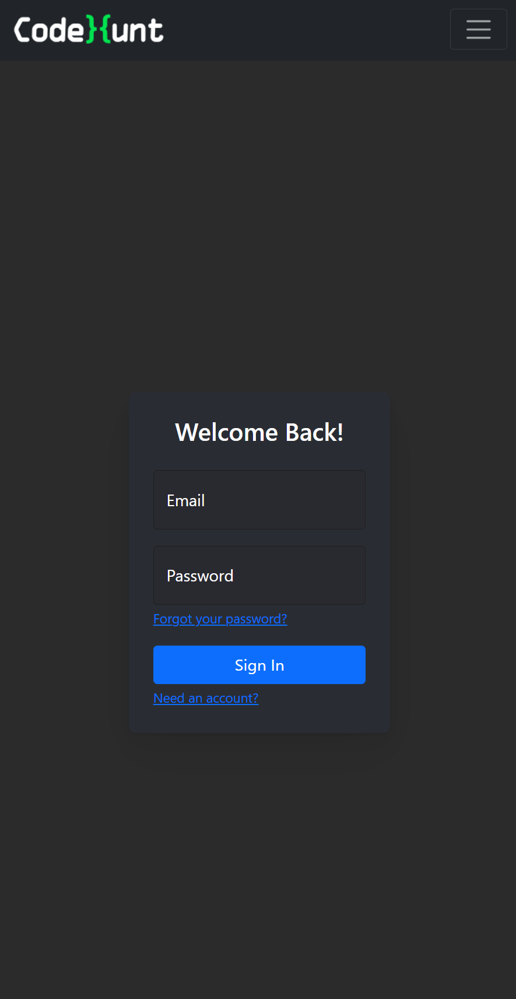
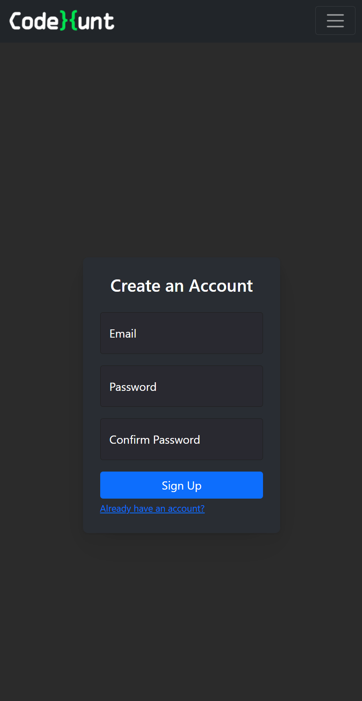
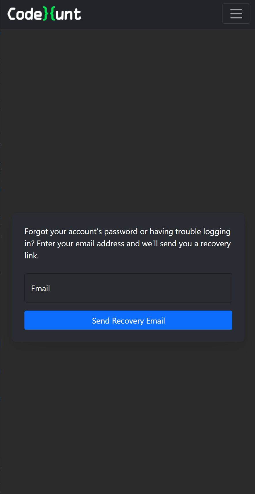
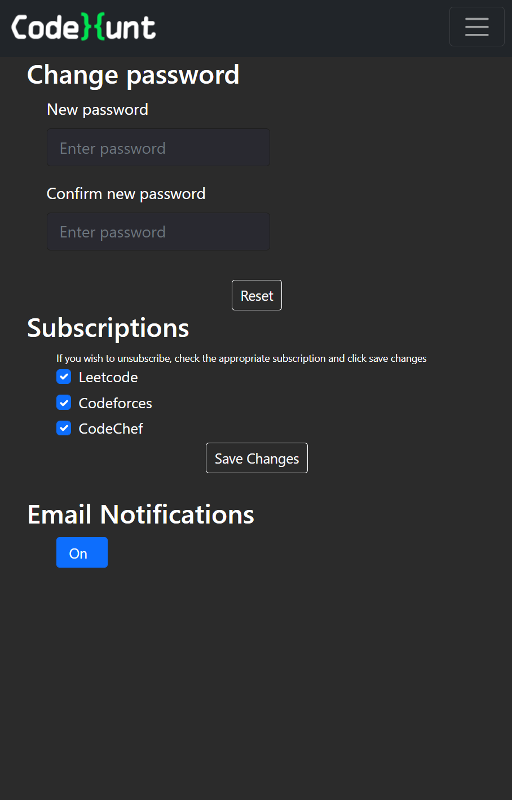
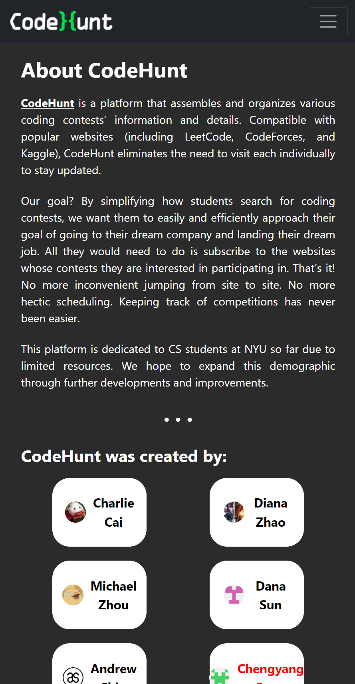
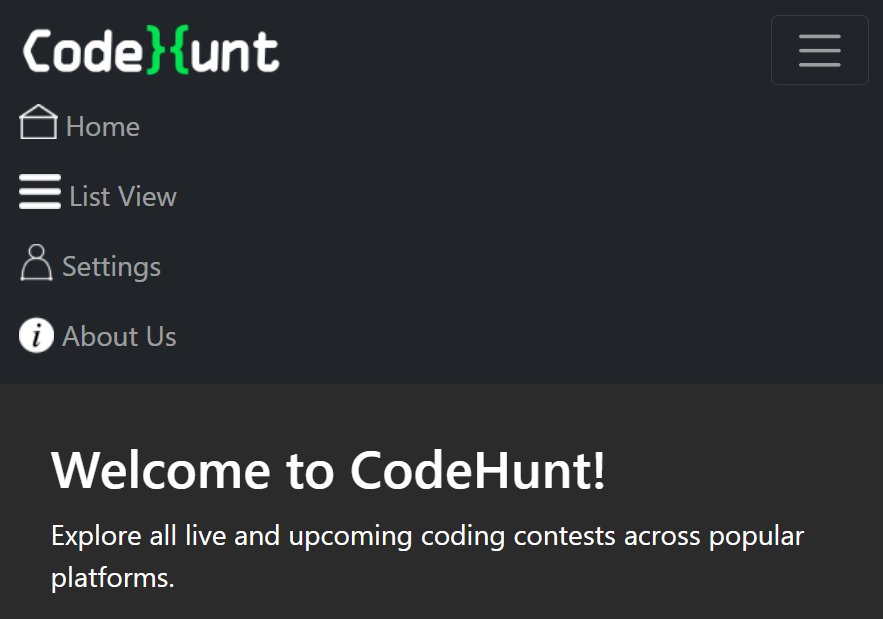

## Product Vision Statement
### What and why?
CodeHunt is a information hub for users in the Computer Science field. In the information age, information overload slows our productivity. There are excessive events/contest occurring on multiple web contest websites, such as LeetCode, CodeForces, Kaggle. It's time-consuming to keep track of all the events by bouncing from website to websites. Our goal is to build a webapp that collects and aggregates information on the user's behalf. All they need to do is login to CodeHunt and see the pages that they have subscribed to and feature events. 
We want to give Computer Science students the opportunity to receive an offer from their dream company and dream job. Students regularly participating in coding contests and events is one step closer to that dream title. Struggling students are overwhelmed when started searching for contests, and even if they did, keeping up to date with the events and maintaining their schedule is inconvenient and unproductive. Our product distribute the resource that allow users to be educated beyond the classrooms.

### For whom?
The end-users are Computer Science enthusiasts and students. Due to limited resources, we provide limited service to CS students at NYU. Narrowing our target will allow us to work with what we are familiar with, so the product best suits the end-users. In the future we will extend the service to anyone interested in CS related events, coding contests, job positions, and the world-wide web.

## CodeHunt is maintained by
- <a href="https://github.com/charliecai00"> Charlie Cai</a>
- <a href="https://github.com/dinanz">Diana Zhao</a>
- <a href="https://github.com/kopokopok">Michael Zhou</a>
- <a href="https://github.com/dana-sun">Dana Sun</a>
- <a href="https://github.com/andrewshin02">Andrew Shin</a>

## Building and installing CodeHunt
### Get the code
1. git clone https://github.com/software-assignments-spring2022/final-project-codehunt
1. Navigate into the project directory

### Build and launch the back end
1. cd back-end
1. add your mongodb atlas server in back-end/.env 
1. npm install
1. npm start

### Build and launch the front end
1. cd front-end
1. npm install
1. npm start

## Help wanted
We have several ideas we would like to see in CodeHunt to make it even better. However, we already work on so many things that we do not have the time for all the big ideas.

This can be your way to support and contribute to CodeHunt - extend it to do something cool.

For everyone who wants to contribute (and send pull requests), please read our [contributing guidelines](./CONTRIBUTING.md) before you submit.

## Website Screenshots
### Main Page

### Favorites page

### Login page

### Signup page

### Recovery page

### Setting page

### About page

### Navigation bar

